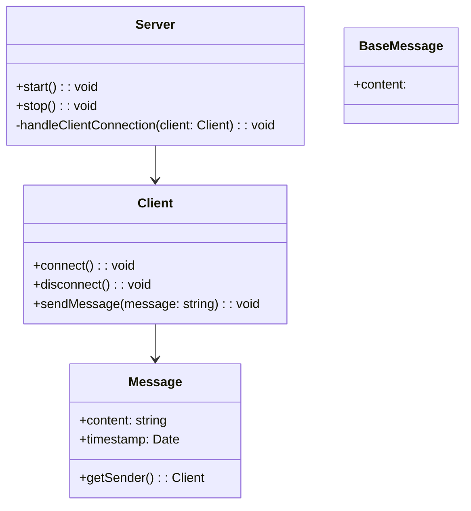

```mermaid

classDiagram
    class Server {
        +start(): void
        +stop(): void
        -handleClientConnection(client: Client): void
    }
    class Client {
        +connect(): void
        +disconnect(): void
        +sendMessage(message: string): void
    }
    class Message {
        +content: string
        +timestamp: Date
        +getSender(): Client
    }

    class BaseMessage{
        +content: 
    }

    Server --> Client
    Client --> Message


```