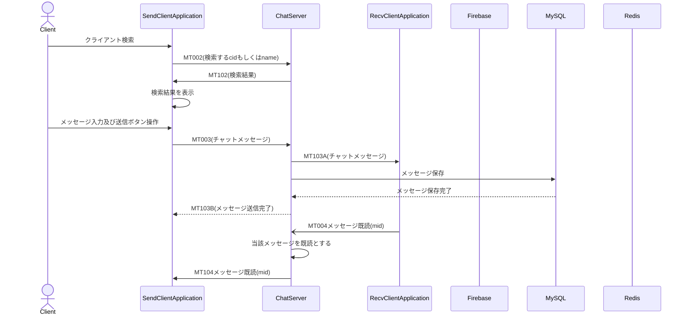

```mermaid
sequenceDiagram

    actor cl as Client
    participant send_clapp as SendClientApplication
    participant server as ChatServer
    participant recv_clapp as RecvClientApplication
    participant Firebase
    participant MySQL
    participant Redis

    #クライアント検索シーケンス
    cl->>send_clapp :クライアント検索
    send_clapp->>server:MT002(検索するcidもしくはname)
    server->>send_clapp:MT102(検索結果)
    send_clapp->>send_clapp:検索結果を表示


     #メッセージ送信シーケンス
    cl->>send_clapp:メッセージ入力及び送信ボタン操作
    send_clapp->>server:MT003(チャットメッセージ)
    server->>recv_clapp:MT103A(チャットメッセージ)
    server->>MySQL:メッセージ保存
    MySQL-->>server:メッセージ保存完了
    server-->>send_clapp:MT103B(メッセージ送信完了)

    recv_clapp-)server:MT004メッセージ既読(mid)
    server->>server:当該メッセージを既読とする
    server->>send_clapp:MT104メッセージ既読(mid)


    
    

    

    
```
