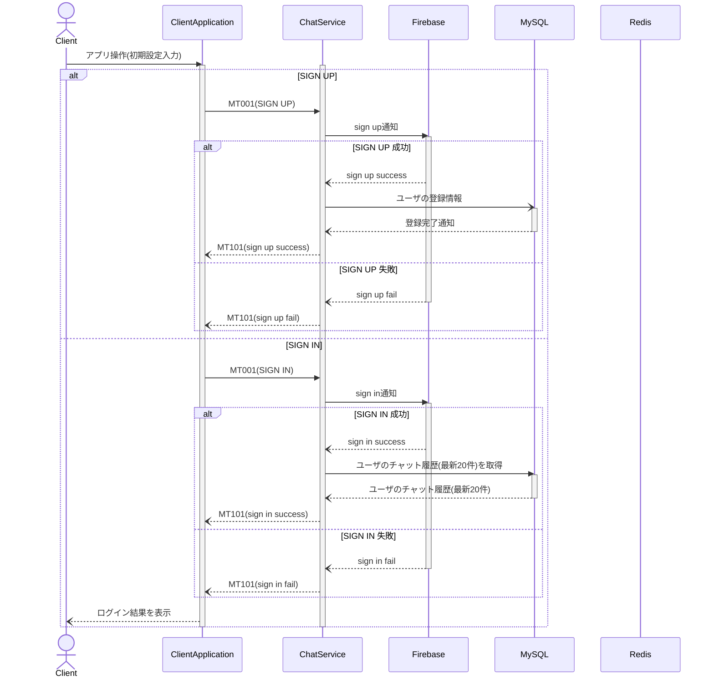

```mermaid
sequenceDiagram

    actor cl as Client
    participant clapp as ClientApplication
    participant server as ChatService
    participant Firebase
    participant MySQL
    participant Redis

    cl ->> clapp : アプリ操作(初期設定入力)
    activate clapp
    activate server
    alt SIGN UP
        clapp ->> server:MT001(SIGN UP)
        
        server->>Firebase : sign up通知
        activate Firebase

        alt SIGN UP 成功
            
            Firebase--)server:sign up success
            server-)MySQL:ユーザの登録情報
            activate MySQL
            MySQL--)server:登録完了通知
            deactivate MySQL            
            server--)clapp:MT101(sign up success)

        else SIGN UP 失敗
            Firebase--)server:sign up fail
            deactivate Firebase
            server--)clapp:MT101(sign up fail)
        end

    else SIGN IN
        clapp ->> server:MT001(SIGN IN)
        server->>Firebase : sign in通知
        activate Firebase
        alt SIGN IN 成功
            Firebase--)server:sign in success
            server->>MySQL:ユーザのチャット履歴(最新20件)を取得
            activate MySQL
            MySQL--)server:ユーザのチャット履歴(最新20件)
            deactivate MySQL
            server--)clapp:MT101(sign in success)
        else SIGN IN 失敗
            Firebase--)server:sign in fail
            deactivate Firebase
            server--)clapp:MT101(sign in fail)
        end
        
    clapp--)cl:ログイン結果を表示
    end
    
    deactivate clapp
    deactivate server
```
